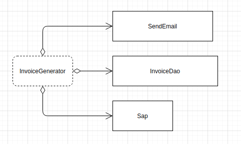
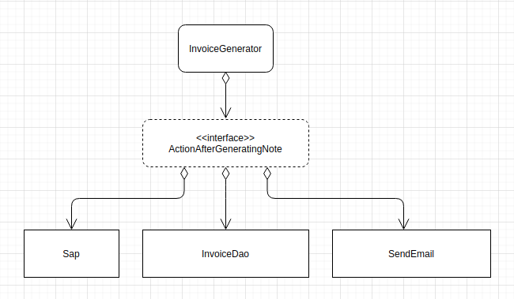

# Dependency inversion principle

## Acoplamento

A separação é importante, mas precisamos juntar todos esses pequenos comportamentos e compor o comportamento maior desejado pelo usuário. Essa é a hora que complica o outro lado da balança, o **acoplamento**.

Exemplo temos a classe `GerarNotaFiscal`:

```java
public class GerarNotaFiscal{
  private final EnviadorDeEmail email
  private final NotaFiscalDao dao

  public GerarNotaFiscal(EnviadorDeEmail email, NotaFiscalDao dao){
    this.email = email
    this.dao = dao
  }

  public NotaFiscal gera(Fatura fatura){
    double valor = fatura.getValorMensal()

    NotaFiscal nf = new NotaFiscal(valor, impostoSimples(valor))

    email.enviaEmail(nf)
    dao.persiste(nf)

    return nf
  }

  private double impostoSimples(){
    return valor * 0.06
  }
}
```

A classe `GerarNotaFiscal` é acomplada a `EnviadorDeEmail` e `NotaFiscalDao`, imagine que precise enviar SMS, a classe `GerarNotaFiscal` vai crescer.

O grande problema do acoplamento é uma mudança em qualquer das classes pode impactar em mudanças na classe principal.

A classe principal quando possui muitas dependências, torna-se muito frágil, fácil de quebrar.




É impossível acabar com acoplamento, dependências vão existir, modelaremos nosso sistema para fugir de acoplamentos perigosos. Ou seja de classes coesas, **estáveis**, que mudam muito pouco.

action after generating note
Interfaces são um bom caminho, afinal interfaces são apenas contratos, e então nossas dependências implemente essa interface.



Agora `GerarNotaFiscal` depende apenas da interface.

## Conceito

Se precisamos acoplar que seja com classes estáveis. Sempre que uma classe depender de outra, ela sempre depender de outro módulos mais estável do que ela mesma.

Tente ao máximo não depender de implementações, tente depender de abstrações.

Você esta invertendo a maneira de depender das coisas, passa a depender agora de abstrações.

No nosso exemplo,  a `AcaoAposGerarNota` é uma abstração estável, já `GerarNotaFiscal` é um implementação o que faz dela uma classe mais instável, mas ele só depende de abstrações.

### Esse princípio afirma duas coisas essenciais:

1. Módulos de alto nível não deveriam ser dependentes de módulos de baixo nível. Ambos devem depender de abstrações.

2. Abstrações não deveriam ser dependentes de detalhes. Detalhes devem depender de abstrações.