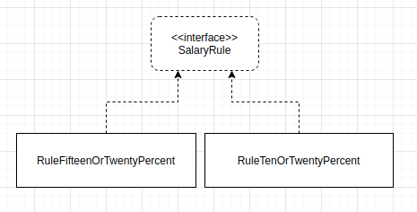

# Single responsibility principle

É justamente o principio que lembra de coesão, a classe deve ter apenas uma responsabilidade.

Como encontrar classes não coesas?

 - Procure por classes que possuem muitos métodos diferentes, por classes que são modificadas com frequência, por classes que não param de crescer.

Então comece a pensar em dividir essas responsabilidades em classes menores.

## Coesão

Coesão: **uma classe coesa é aquela que possui uma única responsabilidade**. Mais simples de serem mantidas, menos código e seu reúso é maior.

Temos a classe `CalculadoraSalario`:

```java
class CalculadoraSalario{
  public double calcula(Funcionario funcionario){
    if(DESENVOLVEDOR.equals(funcionario.getCargo())){
      return dezOuVintePorCento(funcionario)
    }
    if(DBA.equals(funcionario.getCargo())){
      return quinzeOuVintePorCento(funcionario)
    }
  }

  private double dezOuVintePorCento(Funcionario funcionario){
    if(funcionario.getSalarioBase()>3000){
      return funcionario.getSalarioBase() * 0.8
    }else{
      return funcionario.getSalarioBase() * 0.9
    }
  }
}
```

Imagine ter 15, 20, 30 cargos a quantidade de if e else. Essa classe nunca pararia de crescer, e repare **toda classe que não é coesa não para de crescer nunca**.

E caso quiser reutilizar o método `dezOuVintePorCento`, teria que levar toda a classe `CalculadoraSalario`


## Métodos com mesmo esqueleto

Repare que o método `dezOuVintePorCento` e `quinzeOuVintePorCento` possuem o mesmo esqueleto, a ideal então é colocar cada uma dessas regras em classes diferentes e todas elas implementam a mesma interface.



Agora cada regra de calculo esta bem isolada.